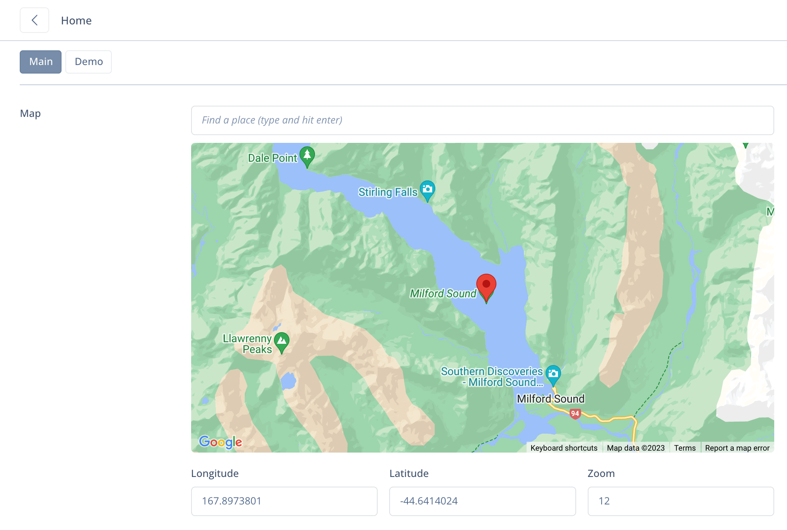
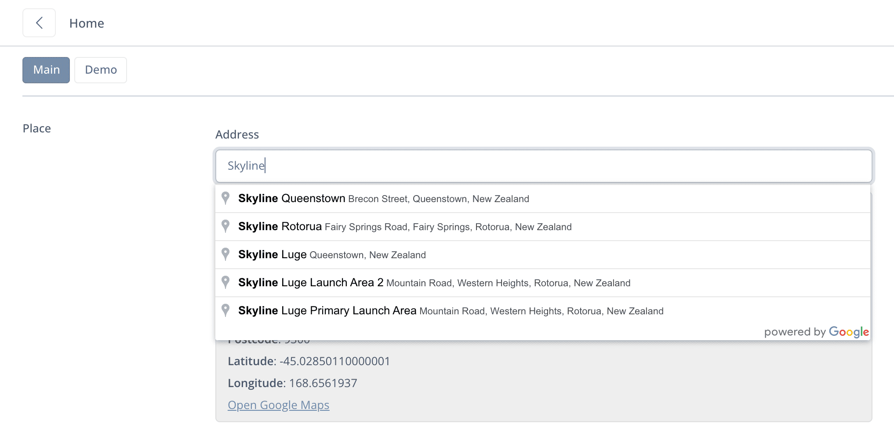

# 🦅 Google Fields for Silverstripe

[](https://packagist.org/packages/spatie/schema-org)
[](https://packagist.org/packages/spatie/schema-org)
[](https://packagist.org/packages/spatie/schema-org)
[](https://packagist.org/packages/spatie/schema-org) 


Google Map and Google Place (Autocomplete) fields for Silverstripe


## Install

```
composer require goldfinch/google-fields
```

## Usage

#### Map component


```php
use Goldfinch\GoogleFields\Forms\MapField;

private static $db = [
  'Map' => 'Map',
];

// ..

MapField::create('Map')

//

MapField::create('Map', 'Map')
  ->setSettings([
      'lng' => 168.7439017,
      'lat' => -45.0136784,
      'zoom' => 10,
  ])
  ->mapHideSearch()
  ->mapHideExtra()
  ->mapReadonly()
```
```html
<!-- template.ss -->

$Map
$Map.Link

$Map.Longitude
$Map.Latitude
$Map.Zoom
```

#### Place autocomplete component


```php
use Goldfinch\GoogleFields\Forms\PlaceField;

private static $db = [
  'Place' => 'Place',
];

// ...

PlaceField::create('Place')

//

PlaceField::create('Place', 'Place')
  ->setSettings([
    'country' => 'ru',
  ])
  ->placeHidePreview()
```
```html
<!-- template.ss -->

$Place.Address
$Place.Data

$Place.Link

$Place.Subpremise
$Place.StreetNumber
$Place.StreetName
$Place.Suburb
$Place.Subarea
$Place.Region
$Place.District
$Place.Country
$Place.Postcode

$Place.PlaceName
$Place.Latitude
$Place.Longitude
```

## License

The MIT License (MIT)
